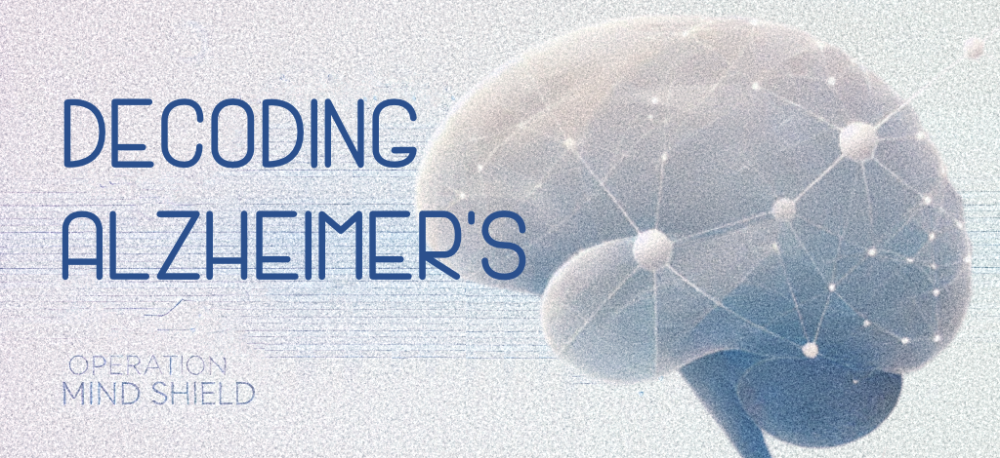

## Project Overview
This project is a web application that aims to predict whether a patient is likely to be diagnosed with Alzheimer's Disease based on key clinical features.
The app uses a binary classification model, trained on a publicly available dataset<sup>1</sup> containing detailed health information 
and Alzheimer's Disease diagnoses for 2,149 patients.

<sup>1</sup> Rabie El Kharoua, _Alzheimer's Disease Dataset_, Kaggle, 2024, https://doi.org/10.34740/KAGGLE/DSV/8668279.

## How It Works
The prediction model is a CatBoost classifier. Initially, it was trained on all 32 features in the dataset, including demographic information, lifestyle factors, 
medical history, clinical measurements, symptoms, and cognitive and functional assessments.
\n
After performing feature importance analysis, the following 5 features were identified as the most predictive:

- **Functional Assessment Score (FA)**: Between 0 and 10. Lower scores indicate greater impairment.
- **Activities of Daily Living (ADL) Score**: Between 0 and 10. Lower scores indicate greater impairment.
- **Mini-Mental State Examination (MMSE) Score**: Between 0 and 30. Lower scores indicate cognitive impairment.
- **Memory Complaints**: Indicates if the patient reports memory issues (Yes/No)
- **Behavioral Problems**: Indicates if the patient has behavioral issues (Yes/No)

The model was retrained using only these 5 key features and fine-tuned to match the performance of the original model
with all 32 features, achieving a mean accuracy of 95.57%, validated through k-fold cross-validation.


### Application Workflow
1. **Enter Patient Data**:
   - Enter values for the 5 key features.
   - Click "Predict" to analyze the input data.

2. **Get Prediction**:
   - The app uses the trained CatBoost model to evaluate the input features.
   - It returns a prediction whether a patient is likely to be diagnosed with Alzheimer's Disease.

## Try It Out
The app is deployed on the Streamlit Community Cloud. You can try it out here: [Operation Mind Shield WebApp](https://jvdm-mm0001-operation-mind-shield.streamlit.app)

## Installation
1. Clone the repository:
   ```bash
   git clone https://github.com/jeroenvdmbrugge/MM0001-Operation-Mind-Shield-WebApp.git

2. Navigate to the project directory:
   ```bash
   cd MM0001-Operation-Mind-Shield-WebApp

3. Install the required dependencies:
   ```bash
   pip install -r requirements.txt

4. Run the Streamlit app:
   ```bash
   streamlit run app.py

## Intended Uses & Limitations

This app and its underlying model are intended for experimental purposes only and should by no means be used for medical diagnoses or decisions.


